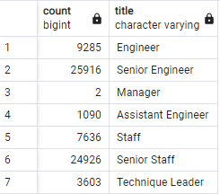
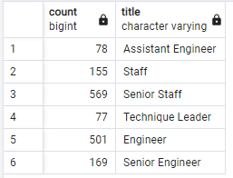

# Pewlett-Hackard-Analysis

Overview of Analysis

The purpose of this analysis is to help prepare Pewlett Hackard for it's oncoming, "silver tsunami" as may of it's most tenured employees are reaching retirement age right around the same time.
While somehwat beneficial for the company as this allows them to bring in a lot of new blood and fresh ideas to positions formerly held by people from a different technological age, poor preperation for this event would leave a lot of the employees who would be stepping into those roles woefully enderprepared. So, this study is to generate a list of senior employees who are about to retire, and a list of employees ready for the next step, to potentially have the people on the way out the door mentor their successors in the time they have left to ensure the switchover is done with minimal stress to the company overall.

Results

There a number of key insights we can gain from this data

The following is a query showing the number of retirement eligible employees grouped by title

* First, of the employees are are slated to retire soon, a large number of them are senior staff or senior engineers. As those positions are the most likely to have their absence  hurt the company, a greater portion of effort should be put into having people in those roles mentor their successors as those positions either going unfilled or being filled by inept or unprepared workers would do the most damage during this wave of retirement.

* As the next largest section of the company to retire, the non-senior staff and engineers would also need to be given time and resources to make sure their deparments aren't hurt by the transition either. For efficiency, a suggestion would be those who have distinguished themselves and are being mentored by the outgoing senior staff and engineers and thus the most likely to assume their roles be in turn responsible for mentoring their successors as well, ensuring uniform training across the company

Ths query shows the employees eligible for mentorship by title

* As you an see, a problem arises with the number of mentor eligible employees; nowhere near enough to fill all the roles about to be vacated. We recommend expanding the criteria for eligibility for mentorship or start looking externally for potential candidates open to being mentored before assuming their new role. Conversely, the company could look at streamlining and restructuring to see if any of those positions are now extraneous

* To that point, wuth only two managers slated for retirement, we reccomend diluting their responsibilities across the rest of the current managers or potentially filtering those responsibilities to the senior staff as the low turnover doesn't need a mentorship program.

Summary

To sum up, there are a disproportionately larger number of employees ready to retire than those ready to assume thier roles based on the criteria provided; we recommend again expanding that criteria or asking senior staff in their roles to manually identify potential candidates they think are ready. Additionally, this data could easily be further grouped by department and other info to provide suggestions for whom to partner with whom for the mentorhip program, i.e group retirement senior staff together with mentorship ready staff who have collaborated in the past. Any level of efficiency in this transition that can be taken must be, given the level of turnover about to happen.